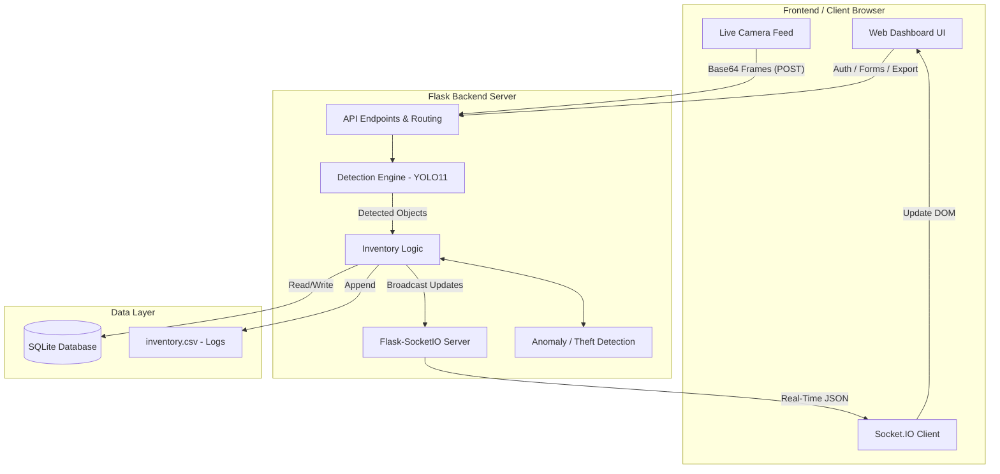
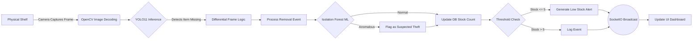

# Smart Shelf Inventory Vision System
## Detailed Project Architecture & Methodology Report

This document outlines the methodology, tools, architecture, and core structures of the **Smart Shelf Inventory Vision System**.

---

## 1. Methodology

The project follows an iterative, AI-driven development methodology, blending Computer Vision (CV) with a real-time web architecture. The development lifecycle is divided into the following phases:

1. **Object Detection & Tracking:** 
   - Utilizes state-of-the-art **YOLO11** (You Only Look Once) for real-time object detection. 
   - Implements **ByteTrack** (`bytetrack.yaml`) to assign unique tracking IDs to products, ensuring stable detection across sequential video frames.
2. **Differential Frame Comparison:**
   - Instead of static counting, the system uses a differential logic algorithm. It compares the bounding boxes and labels in the current frame ($t$) against the previous frame ($t-1$).
   - An increase in count triggers an **Addition** event, while a decrease triggers a **Removal** event.
3. **Predictive AI & Anomaly Detection:**
   - Incorporates Machine Learning (ML) for security. An **Isolation Forest** anomaly detection model analyzes the removal events (quantity removed vs. time elapsed). 
   - Rapid or unusually large removals are flagged automatically as suspected theft.
4. **Real-Time Data Synchronization:**
   - When an event occurs, the backend updates the relational database and immediately broadcasts the change to all connected client dashboards using WebSockets.
5. **Role-Based Access & Reporting:**
   - Secure authentication system distinguishing between Admin and Staff users.
   - Automated data export functionality to convert database tables into Excel reports.

---

## 2. Tools & Technologies Used

The project is built on a modern Python stack. Below is the breakdown of all tools and their specific purpose in the project:

| Category | Tool / Library | Purpose in Project |
| :--- | :--- | :--- |
| **Core Language** | Python 3.x | The primary language used for backend routing, AI logic, and data processing. |
| **Web Framework** | Flask | Serves the web application, handles HTTP requests, API routes, and renders HTML templates. |
| **Real-Time Comm.** | Flask-SocketIO | Establishes WebSocket connections to push live inventory updates and theft alerts to the web dashboard instantly. |
| **Computer Vision** | Ultralytics (YOLO11) | The core AI model (`yolo11n.onnx` / `.pt`) used to detect and classify products on the shelf in real-time. |
| **Image Processing** | OpenCV (`cv2`) | Used to decode base64 images from the frontend webcam feed and process frames for the YOLO model. |
| **Machine Learning** | Scikit-Learn | Specifically uses `IsolationForest` to predict and detect anomalous inventory removals (Theft detection). |
| **Database** | SQLite & SQLAlchemy | SQLite acts as the lightweight relational database (`inventory.db`). SQLAlchemy is the ORM used to map Python classes to database tables. |
| **Data Processing** | Pandas & OpenPyxl | Used to process inventory data and export it to downloadable Excel `.xlsx` reports. |
| **Security** | Bcrypt / Passlib | Secures the authentication system by hashing user passwords. |
| **Frontend** | HTML5, CSS3, JS, Jinja2| Creates the user interface. Jinja2 dynamically renders data from Flask, while vanilla JS handles WebSocket listeners and dynamic DOM updates. |

---

## 3. Architecture Diagram

The system follows a decoupled Client-Server architecture with an integrated AI pipeline.

---

## 4. Block Diagram

The block diagram below illustrates the flow of data from the moment a physical item is picked up from the shelf to the moment the manager sees the alert.

---

## 5. Important Data Structures (Database Schema)

The system relies on a relational database managed by SQLAlchemy. Below are the core entities:

### 1. `Product` Structure
Stores the catalog of physical items being tracked.
- **id**: Integer (Primary Key)
- **name**: String (Unique product identifier, mapped to YOLO classes like 'Apple', 'Milk')
- **stock**: Integer (Current real-time quantity)
- **threshold**: Integer (Minimum stock level before generating a low-stock alert)
- **category**: String (e.g., General, Electronics, Food)
- **price**: Float
- **updated_at**: DateTime (Timestamp of last stock change)

### 2. `Event` Structure
An immutable audit log tracking every single transaction on the shelf. Used for historical analysis and ML training.
- **id**: Integer (Primary Key)
- **product_name**: String (Foreign Key reference conceptually)
- **event_type**: String (`"ADDITION"` or `"REMOVAL"`)
- **quantity_removed**: Integer
- **confidence**: Float (AI detection confidence score, e.g., `0.95`)
- **timestamp**: DateTime

### 3. `Alert` Structure
Stores active notifications that require human intervention.
- **id**: Integer (Primary Key)
- **product_name**: String
- **message**: Text (Contains exact reason: Theft warning vs. Out of Stock vs. Low Stock)
- **is_resolved**: Boolean (Default `False`. Store managers must manually resolve)
- **timestamp**: DateTime
- **resolved_at**: DateTime (Nullable)

### 4. `User` Structure
Manages access control to the dashboard.
- **id**: Integer
- **username**: String (Unique)
- **hashed_password**: String (Bcrypt secure hash)
- **role**: String (`"admin"` or `"user"`)
- **is_active**: Boolean
