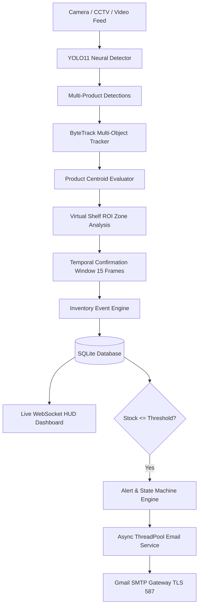

# Smart Inventory Management System

[](https://www.python.org/)
[](https://fastapi.tiangolo.com/)
[](https://react.dev/)
[](https://ultralytics.com/)
[](LICENSE.md)

An enterprise-grade, real-time Computer Vision inventory monitoring, multi-product tracking, shelf spatial analysis, and loss-prevention platform designed for modern retail environments, automated convenience stores, and smart warehouses.

---

## 📑 Table of Contents
1. [Overview](#-overview)
2. [Key Features](#-key-features)
3. [System Architecture](#-system-architecture)
4. [Technologies Used](#-technologies-used)
5. [Project Structure](#-project-structure)
6. [Installation & Setup](#-installation--setup)
7. [Environment Configuration](#-environment-configuration)
8. [Running the Application](#-running-the-application)
9. [AI / YOLO11 Multi-Product Pipeline](#-ai--yolo11-multi-product-pipeline)
10. [Dataset Download, Preparation & Validation](#-dataset-download-preparation--validation)
11. [Authentication & Role-Based Access](#-authentication--role-based-access)
12. [Gmail Low-Stock Notifications](#-gmail-low-stock-notifications)
13. [Troubleshooting Guide](#-troubleshooting-guide)

---

## 🌟 Overview

The **Smart Inventory Management System** eliminates manual barcode scanning and RFID bottlenecks by utilizing autonomous computer-vision models to track store inventory dynamically.

The system combines:
- **YOLO11 Neural Detection**: Identifies multiple distinct product classes in the same frame simultaneously.
- **ByteTrack Multi-Object Tracking**: Maintains persistent Track IDs across frames for every physical item.
- **Virtual Shelf ROI Monitoring**: Maps real-world physical shelves into normalized polygonal zones.
- **Temporal Event Confirmation**: Requires 15-frame spatial persistence before committing stock changes, preventing count flickering and false removals.
- **Automated Gmail Alerts**: Sends low-stock and out-of-stock email notifications when inventory crosses thresholds.
- **Glassmorphic React Dashboard**: Delivers real-time camera HUDs, stock charts, model training telemetry, and alert triage.

---

## 🚀 Key Features

- **Multi-Product Recognition**: Detects multiple products (e.g. Apple, Banana, Milk, Water Bottle, Bread, Lays, Biscuits, Beverages, Snacks) in single frames with individual bounding boxes.
- **ByteTrack Trajectory Persistence**: Preserves item identity even during momentary hand or product occlusion.
- **Shelf ROI Containment & Misplaced Alerts**: Detects when items are placed on incorrect category shelves (e.g., snacks placed in dairy zones).
- **Temporal Event Engine**: Prevents count flickering by verifying that removals or additions persist across a rolling confirmation window.
- **Automated Gmail Notification Engine**: Delivers branded HTML low-stock alerts to administrators with two-layer state machine deduplication.
- **Custom Model Studio & Hot-Reloading**: Train custom YOLO11 models from the UI, inspect real-time epoch telemetry, review confusion matrices, and hot-swap active models at runtime with instant rollback.
- **Dataset Pipeline Automation**: Ingests, deduplicates via MD5, normalizes taxonomy, creates 70/20/10 train/val/test splits, and generates interactive HTML audit reports (`dataset_report.html`).
- **Role-Based JWT Security**: Defends against brute-force attacks with IP rate limiting, account lockouts, secure HTTPOnly cookies, and strict password hashing.

---

## 🏛️ System Architecture



---

## 💻 Technologies Used

| Domain | Technology / Library | Description |
| :--- | :--- | :--- |
| **Computer Vision** | `Ultralytics (YOLO11 / YOLOv8)` | Real-time object detection and transfer learning |
| **Object Tracking** | `ByteTrack` | Kalman-filter multi-object tracking with persistent track IDs |
| **Image Processing** | `OpenCV (cv2)` & `NumPy` | Video frame extraction, spatial transforms, IoU calculations |
| **Backend Framework** | `FastAPI` + `Uvicorn` | High-performance asynchronous REST API server |
| **Real-Time Feed** | `WebSockets` | Full-duplex live detection telemetry streaming |
| **Database & ORM** | `SQLite3` + `SQLAlchemy 2.0` | ACID-compliant storage for products, shelves, events, and logs |
| **Security & Auth** | `python-jose` + `Passlib (Bcrypt)` | Secure JWT authentication, password policy, and rate limiting |
| **Email Subsystem** | `Python smtplib` + `email.mime` | Asynchronous Gmail SMTP client with TLS 587 and exponential retries |
| **Frontend App** | `React 18/19` + `React Router` | Glassmorphic, responsive single-page store management application |
| **Visual Charts** | `Recharts` | Real-time interactive charts for stock, loss prevention, and training |
| **UI Components** | `Lucide React` + Vanilla CSS | Modern dark glassmorphic design system |

---

## 📁 Project Structure

```
smart-inventory-management-system/
├── backend/
│   ├── app/
│   │   ├── ai/
│   │   │   ├── detection/detector.py      # YOLO11 detector with hot-reloading
│   │   │   ├── tracking/tracker.py        # ByteTrack multi-object tracker
│   │   │   ├── inventory/shelf_monitor.py # Virtual shelf ROI spatial evaluator
│   │   │   └── pipeline.py                # End-to-end vision coordinator
│   │   ├── notifications/
│   │   │   ├── email_service.py           # Async Gmail SMTP dispatcher
│   │   │   └── email_templates.py         # Branded responsive HTML templates
│   │   ├── auth.py                        # JWT authentication & password hashing
│   │   ├── database.py                    # SQLAlchemy session & Base
│   │   ├── models.py                      # SQLAlchemy ORM database models
│   │   ├── routes.py                      # FastAPI REST & ML endpoints
│   │   └── schemas.py                     # Pydantic request/response schemas
│   ├── test_system.py                     # 8-scenario system integration tests
│   ├── test_notifications.py              # 10-scenario Gmail notification tests
│   └── test_security.py                   # 13-scenario authentication security tests
├── frontend/
│   ├── src/
│   │   ├── pages/
│   │   │   ├── Dashboard.js               # Store overview & quick metrics
│   │   │   ├── LiveMonitor.js             # Real-time camera canvas HUD
│   │   │   ├── ModelTraining.js           # ML studio, dataset audit, and training
│   │   │   ├── Shelves.js                 # Shelf ROI zone configuration
│   │   │   └── Inventory.js               # Product stock levels & thresholds
│   │   └── api.js                         # Axios API client
├── ml/
│   ├── config/
│   │   ├── taxonomy.json                  # Canonical multi-product taxonomy
│   │   └── training_config.json           # Epochs, batch size, image size
│   ├── datasets/
│   │   ├── dataset_manifest.json          # Dataset provenance & licenses
│   │   ├── dataset_report.html            # Visual HTML dataset audit report
│   │   └── README.md                      # Dataset sourcing instructions
│   ├── models/
│   │   └── active_model.json              # Currently active model pointer
│   ├── scripts/
│   │   ├── download_datasets.py           # Permissive retail dataset ingester
│   │   ├── prepare_dataset.py             # Deduplicator, normalizer & 70/20/10 split
│   │   ├── validate_dataset.py            # Bounding box & geometry validator
│   │   └── model_manager.py               # Model registry, hot-swapping & DB sync
│   └── training/
│       ├── train.py                       # YOLO11 transfer learning engine
│       └── progress.json                  # Live per-epoch training metrics
├── .env.example                           # Safe environment configuration template
├── .gitignore                             # Git ignore rules for secrets, DBs, and datasets
└── README.md                              # Main documentation
```

---

## 🛠️ Installation & Setup

### 1. Prerequisites
- **Python**: 3.10, 3.11, or 3.12
- **Node.js**: v18.0+ and `npm`
- **Git**: Installed and configured

### 2. Clone the Repository
```bash
git clone https://github.com/vinaykumar35678-source/smart-inventory-management-system.git
cd smart-inventory-management-system
```

### 3. Backend Setup
Create and activate a virtual environment:
```bash
# Windows
python -m venv venv
venv\Scripts\activate

# Linux / macOS
python3 -m venv venv
source venv/bin/activate
```

Install backend dependencies:
```bash
pip install -r backend/requirements.txt
```

### 4. Frontend Setup
```bash
cd frontend
npm install
cd ..
```

---

## ⚙️ Environment Configuration

Copy the sample environment file to `.env`:
```bash
cp .env.example .env
```

Configure your environment variables:
```ini
# Application
APP_NAME="SmartShelf Vision AI"
ENVIRONMENT=development

# Database
DATABASE_URL="sqlite:///./inventory.db"

# Authentication Secret (Change for production)
AUTH_SECRET_KEY=change_me_to_a_cryptographically_secure_random_key_64_bytes

# YOLO Model Configuration
YOLO_MODEL=yolo11n.pt
CONFIDENCE_THRESHOLD=0.45

# Gmail / SMTP Notifications (Optional)
GMAIL_ENABLED=false
GMAIL_USERNAME=your-store-alert@gmail.com
GMAIL_APP_PASSWORD=xxxx-xxxx-xxxx-xxxx
GMAIL_FROM=your-store-alert@gmail.com
```

---

## 🏃 Running the Application

### 1. Start the Backend API Server
```bash
# Make sure your virtual environment is active
uvicorn backend.app.main:app --host 0.0.0.0 --port 8000 --reload
```
The FastAPI documentation will be available at: `http://localhost:8000/docs`

### 2. Start the Frontend React App
In a separate terminal:
```bash
cd frontend
npm start
```
The SmartShelf dashboard will open at: `http://localhost:3000`

### 3. Default Login Credentials
The system automatically seeds development accounts on initial startup:
- **Admin**: `admin` / `Admin@123`
- **Staff**: `user1` / `User@123`

---

## 🧠 AI / YOLO11 Multi-Product Pipeline

The system uses **YOLO11** transfer learning to classify and track multi-item retail shelves.

### Pre-Flight System Check
Before starting training, the system checks system resources (RAM, disk space, and CUDA/CPU) to prevent crashes:
```bash
python ml/training/train.py --check-resources
```

### Starting Training via CLI
```bash
python ml/training/train.py --data ml/datasets/merged/data.yaml --model yolo11n.pt --epochs 20 --batch 8
```

### Starting Training via Web Dashboard
1. Navigate to **Model Training** in the React navigation bar.
2. Select **Training Studio**.
3. Choose the base architecture:
   - `yolo11s.pt` (YOLO11 Small — Recommended for accuracy)
   - `yolo11n.pt` (YOLO11 Nano — Resource-efficient CPU execution)
   - `yolov8n.pt` (Legacy Baseline)
4. Click **Start Custom YOLO Training** (training never starts automatically).
5. Monitor live per-epoch precision, recall, loss, and mAP@0.50.

### Hot-Swapping & Rollback
- Once trained, models are registered in `ml/models/`.
- Click **Activate for Live Detection** to switch the running pipeline without server restarts.
- Click **Rollback to Baseline Model** at any time to immediately revert to standard baseline weights.
- Click **Sync Active Classes to DB** to automatically update the SQLite `products` table with detected classes.

---

## 📦 Dataset Download, Preparation & Validation

### 1. Ingest Retail Datasets
Download or ingest the approved retail datasets into `ml/datasets/raw/`:
```bash
python ml/scripts/download_datasets.py
```
This records dataset licenses, source URLs, and class counts in `ml/datasets/dataset_manifest.json`.

### 2. Prepare & Merge (70/20/10 Split)
Normalize annotations against the canonical taxonomy, eliminate duplicate images using MD5 hashes, and split into train/val/test without intra-scene leakage:
```bash
python ml/scripts/prepare_dataset.py
```

### 3. Validate Dataset & Generate HTML Report
Verify bounding box ranges `[0.0, 1.0]`, detect corrupted images, and generate the audit report:
```bash
python ml/scripts/validate_dataset.py
```
Open `ml/datasets/dataset_report.html` in your browser to inspect class balance charts and sample bounding box overlays.

---

## 🔒 Authentication & Role-Based Access

The backend implements enterprise security standards:
- **Password Security**: Bcrypt with minimum 8 characters, requiring uppercase, lowercase, numbers, and symbols.
- **Brute-Force Protection**: IP rate limiting with progressive delays and account lockout after 5 consecutive failed attempts.
- **JWT Tokens**: Short-lived HS256 tokens stored securely with configurable expiration.
- **Role Verification**: Admin-restricted endpoints for model activation, dataset import, and user management.

---

## 📧 Gmail Low-Stock Notifications

When an item's validated quantity drops to or below its threshold:
1. The inventory event is verified via the 15-frame temporal state machine.
2. The product transitions to `LOW_STOCK` (or `OUT_OF_STOCK` if 0).
3. The email service delivers a responsive HTML alert showing current quantity, threshold, shelf name, and direct dashboard link.
4. Alerts are logged in the `notification_logs` table to prevent duplicate notifications until stock is replenished.

### Setting Up Gmail
1. Enable **2-Step Verification** on your Google account.
2. Visit [Google App Passwords](https://myaccount.google.com/apppasswords) and create an app password (e.g., name: `SmartShelf AI`).
3. Set `GMAIL_ENABLED=true`, `GMAIL_USERNAME=your-email@gmail.com`, and `GMAIL_APP_PASSWORD=xxxx-xxxx-xxxx-xxxx` in `.env`.

---

## 🔧 Troubleshooting Guide

| Issue | Cause | Solution |
| :--- | :--- | :--- |
| `database is locked` | Concurrent SQLite write contention during heavy test runs | Ensure single-process access or increase SQLite timeout in `database.py`. |
| `CUDA out of memory` | Batch size or image size too large for GPU VRAM | Set `--batch 4` or `--imgsz 320`, or train on CPU with `device=cpu`. |
| `UnicodeEncodeError: 'charmap'` | Windows command prompt encoding | All scripts now use ASCII-safe logging symbols. |
| `SMTPAuthenticationError` | Invalid Gmail App Password | Use a 16-character Google App Password with 2-Step Verification enabled, not your main password. |
| Camera frame latency | High resolution webcam stream | Set `--imgsz 640` or reduce camera frame rate in `ai_config.json`. |

---

## 📄 License

This project is licensed under the Creative Commons Attribution-NoDerivatives 4.0 International Public License (CC BY-ND 4.0) — see the [LICENSE.md](LICENSE.md) file for details.
