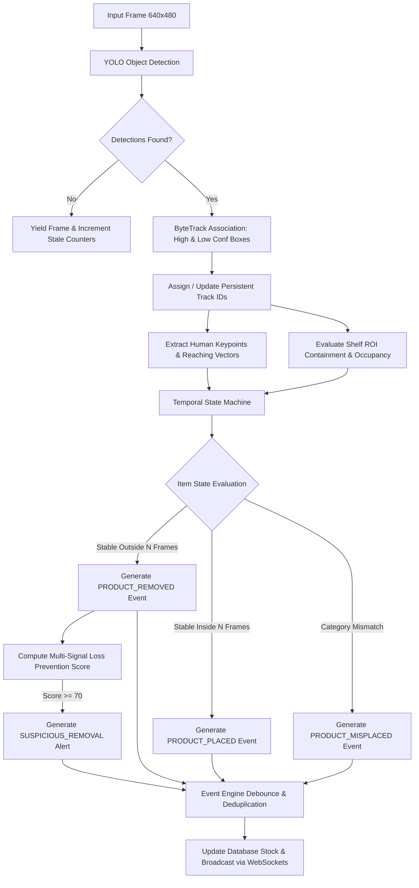
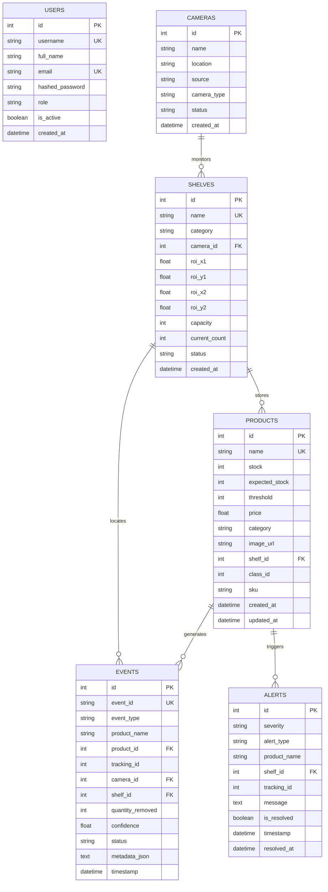
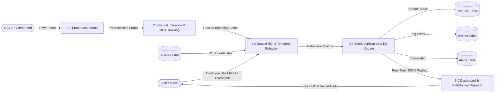
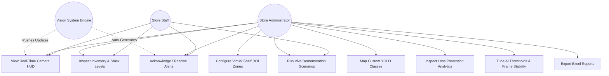
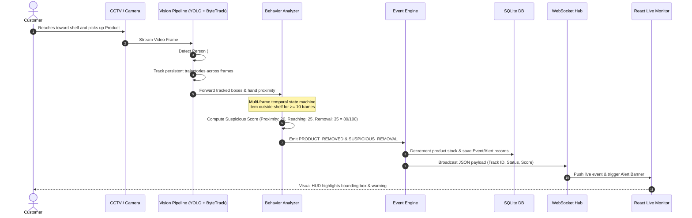

# 🛒 AI-Powered Smart Inventory & Loss Prevention Vision System

[](https://www.python.org/)
[](https://fastapi.tiangolo.com/)
[](https://react.dev/)
[](https://ultralytics.com/)
[]()
[]()

An enterprise-grade, real-time Computer Vision (CV) inventory monitoring, shelf spatial tracking, and loss-prevention system designed for modern retail environments, automated convenience stores, and smart warehouses.

---

## 📑 Table of Contents
1. [Project Overview](#-project-overview)
2. [Key Architectural Highlights](#-key-architectural-highlights)
3. [System Architecture & UML Diagrams](#-system-architecture--uml-diagrams)
   - [1. System Architecture Diagram](#1-system-architecture-diagram)
   - [2. AI / Computer Vision Pipeline Diagram](#2-ai--computer-vision-pipeline-diagram)
   - [3. Database Entity-Relationship (ER) Diagram](#3-database-entity-relationship-er-diagram)
   - [4. Data Flow Diagram (DFD Level 1)](#4-data-flow-diagram-dfd-level-1)
   - [5. Use Case Diagram](#5-use-case-diagram)
   - [6. Sequence Diagram (Detection & Loss Prevention)](#6-sequence-diagram)
4. [Technology Stack](#-technology-stack)
5. [Installation & Setup](#-installation--setup)
6. [Running the Application](#-running-the-application)
7. [AI / CV Pipeline & Model Training](#-ai--cv-pipeline--model-training)
8. [Virtual Shelf ROI & Camera Configuration](#-virtual-shelf-roi--camera-configuration)
9. [REST API & WebSocket Documentation](#-rest-api--websocket-documentation)
10. [College Viva & Demo Mode Presentation Guide](#-college-viva--demo-mode-presentation-guide)
11. [Troubleshooting Guide](#-troubleshooting-guide)

---

## 🌟 Project Overview

Traditional inventory management relies on periodic manual barcode scans or RFID infrastructure, which are labor-intensive, error-prone, and incapable of detecting real-time theft or misplacement.

This project upgrades inventory management into an autonomous AI-driven vision system capable of:
- **Product Detection & Classification**: Real-time identification using YOLOv8/YOLO11 neural networks.
- **Multi-Object Tracking (MOT)**: Assigning persistent tracking IDs to persons and products across frames via **ByteTrack**.
- **Virtual Shelf / ROI Zone Monitoring**: Dynamic coordinate mapping defining physical shelves, calculating detected count vs. expected capacity.
- **Misplaced Product Identification**: Real-time detection when products are placed on incorrect category shelves (e.g., snacks placed in beverage zones).
- **Temporal Product State Analysis**: Distinguishing between momentary occlusions and actual removals/restocks using a multi-frame temporal state machine.
- **Loss Prevention / Suspicious Activity Scoring**: Multi-signal behavior scoring based on person proximity, arm reaching gesture, shelf zone exit, and unverified rapid removal.
- **Real-Time WebSocket Dashboard**: Live canvas HUD displaying bounding boxes, tracking labels, pose lines, and instant alerts.

---

## 🏛️ System Architecture & UML Diagrams

### 1. System Architecture Diagram

```mermaid
graph TB
    subgraph Video_Sources [Video Input Layer]
        CCTV[CCTV Camera Stream]
        Webcam[Laptop / USB Webcam]
        Upload[Uploaded MP4 Video]
        DemoSim[Viva Demo Simulator]
    end

    subgraph AI_Engine [AI & Computer Vision Core (backend/app/ai)]
        Detector[YOLOv8/11 Object Detector]
        Tracker[ByteTrack Multi-Object Tracker]
        Pose[Pose & Reaching Estimator]
        ShelfMgr[Virtual Shelf ROI Zone Monitor]
        Behavior[Temporal Behavior & Loss Prevention Engine]
        EventEng[Centralized Event Engine & Debouncer]
    end

    subgraph Backend_App [FastAPI Backend Service (:8000)]
        API[RESTful API Router]
        WS[WebSocket Hub /ws]
        Auth[JWT & Role-Based Access Control]
        ORM[SQLAlchemy ORM Layer]
        DB[(SQLite inventory.db)]
    end

    subgraph Frontend_App [React 19 Glassmorphic Dashboard (:3000)]
        LiveHUD[Live Monitor with Canvas HUD Overlays]
        ShelvesUI[Visual Shelf & ROI Configurator]
        AnalyticsUI[Recharts Stock & Loss Prevention Analytics]
        DiagUI[AI Model Performance & Latency Monitor]
        AuditUI[Event Audit Trail & Alert Resolution]
    end

    Video_Sources --> Detector
    Detector --> Tracker
    Tracker --> Pose
    Pose --> ShelfMgr
    ShelfMgr --> Behavior
    Behavior --> EventEng

    EventEng --> ORM --> DB
    EventEng --> WS --> LiveHUD
    EventEng --> WS --> AuditUI
    API --> ORM
    API --> DiagUI
    API --> ShelvesUI
    API --> AnalyticsUI
```

---

### 2. AI / Computer Vision Pipeline Diagram



---

### 3. Database Entity-Relationship (ER) Diagram



---

### 4. Data Flow Diagram (DFD Level 1)



---

### 5. Use Case Diagram



---

### 6. Sequence Diagram



---

## 💻 Technology Stack

| Domain | Technology / Library | Purpose |
| :--- | :--- | :--- |
| **AI / Computer Vision** | `ultralytics (YOLOv8 / YOLO11)` | Real-time object detection & pose estimation |
| **Object Tracking** | `ByteTrack` | Persistent multi-object tracking across frames |
| **Image Processing** | `OpenCV (cv2)` & `NumPy` | Video frame extraction, spatial transforms, IoU calculations |
| **Machine Learning** | `Scikit-Learn` & `PyTorch` | Spatial heuristics and anomaly score analysis |
| **Backend Framework** | `FastAPI` + `Uvicorn` | Asynchronous REST API server and thread pooling |
| **Real-Time Communication**| `WebSockets` | Low-latency duplex live detection telemetry |
| **Database & ORM** | `SQLite3` + `SQLAlchemy 2.0` | Relational storage for products, shelves, cameras, and audit trails |
| **Security & Auth** | `python-jose` + `Passlib (Bcrypt)` | Secure JWT authentication & role-based route protection |
| **Frontend Framework** | `React 19` + `React Router 7` | Responsive glassmorphic single-page web application |
| **Data Visualization** | `Recharts` | Interactive real-time charts for stock trends and loss prevention |
| **UI Components & Icons**| `Lucide React` + Vanilla CSS | Modern dark glassmorphic design system |

---

## 🚀 Installation & Setup

### Prerequisites
- Python 3.10 or higher
- Node.js v18+ and npm v9+
- Optional: NVIDIA CUDA GPU (System automatically falls back to optimized CPU execution)

### 1. Clone & Set Up Backend
```powershell
# Navigate to project root
cd "d:\major proj2"

# Activate python virtual environment
.\venv\Scripts\Activate.ps1

# Install / verify dependencies
pip install -r backend/requirements.txt
pip install httpx scikit-learn
```

### 2. Set Up Frontend
```powershell
cd frontend
npm install
```

---

## 🏃 Running the Application

### Step 1: Start FastAPI Backend Server
```powershell
# In terminal 1 (with venv activated):
python backend/run.py
```
> Backend runs at: `http://localhost:8000`  
> Interactive OpenAPI documentation: `http://localhost:8000/docs`

### Step 2: Start React Frontend
```powershell
# In terminal 2:
cd frontend
npm start
```
> Web Dashboard opens at: `http://localhost:3000`

### Default Login Credentials
| Username | Password | Role | Description |
| :--- | :--- | :--- | :--- |
| `admin` | `Admin@123` | **Administrator** | Full access: ROI editor, custom classes, thresholds, users |
| `user1` | `User@123` | **Staff** | Operational view: live monitoring, alerts, inventory |

---

## 🧠 Custom Dataset Import & Model Training Studio

The system features a dedicated Machine Learning studio (`ml/`) and a 5-tab frontend dashboard (`/training`) for training custom YOLO models and seamlessly hot-swapping them into the real-time detection pipeline without server downtime.

### Directory Structure
```
ml/
├── datasets/           # Imported dataset repositories (folder, ZIP, or default)
├── training/           # Training scripts & real-time progress.json
│   └── train.py
├── models/             # Multi-version model registry & active_model.json
│   ├── inventory_v1/   # best.pt + metadata.json + confusion_matrix.png
│   └── inventory_v2/
├── scripts/            # Dataset manager, validation, and model management
│   ├── dataset_manager.py
│   └── model_manager.py
└── config/             # Centralized training hyperparameters
    └── training_config.json
```

### 1. Dataset Import & Validation
Datasets in standard YOLO format (`images/`, `labels/`, `data.yaml`) can be imported from:
- **Local Directory**
- **ZIP File** (automatically extracted and parsed)
- **Existing Project Directory** (`smart_shelf/dataset` with 150 images, 13 classes)

#### Automated Validation Checks:
- Checks image/label pairing and detects missing files
- Validates YOLO normalized coordinates $(x_c, y_c, w, h \in [0.0, 1.0])$
- Detects corrupt or unreadable image files via OpenCV
- Flags empty or malformed label files
- Computes complete **Class Distribution** frequency table

### 2. Dataset Visual Preview
The dataset preview tool renders sample images with bounding boxes and class tags drawn directly from label files, allowing you to visually verify annotation alignment before training.

### 3. Model Training & Transfer Learning
Transfer learning from pretrained weights (`yolov8n.pt`, `yolov8s.pt`, `yolov8m.pt`, `yolo11n.pt`):
```powershell
python ml/training/train.py --data smart_shelf/data.yaml --model yolov8n.pt --epochs 25 --batch 8
```
- **Hardware Auto-Detection**: Detects NVIDIA CUDA GPU; automatically falls back to CPU.
- **Live Telemetry**: Per-epoch progress bar, loss, precision, recall, mAP@0.50, and mAP@0.50:0.95 broadcast in real-time.

### 4. Dynamic Model Activation & Hot-Swapping
In the **Model Registry** tab (`/training`):
- All trained versions (`ml/models/*`) are listed alongside the base pretrained model.
- Clicking **"Activate for Live Detection"** hot-swaps the model weights and custom class mappings in `YOLODetector` immediately without restarting the backend!
- Downstream modules (`ByteTrack`, `ShelfMonitor`, `BehaviorAnalyzer`, `LiveMonitor.js`) instantly use the active custom model.

### 5. Model Testing Playground & Viva Comparison
- **Playground**: Upload any test image or capture a webcam frame to preview detections, confidence scores, and mapped inventory product names.
- **Viva Comparison Table**: Side-by-side comparison table between Pretrained YOLO and Custom Trained YOLO (Precision, Recall, mAP50, mAP50-95, Latency ms).

---

## 🗄️ Virtual Shelf ROI & Camera Configuration

1. Log in to the dashboard as `admin`.
2. Navigate to **Shelves & ROI** (`/shelves`).
3. View existing virtual zones (e.g., *Shelf 1 - Fresh Produce*, *Shelf 2 - Dairy & Essentials*).
4. Click **Edit ROI** to adjust normalized coordinates (`roi_x1`, `roi_y1`, `roi_x2`, `roi_y2`).
5. Products placed inside the designated shelf bounding box are automatically counted. Products placed in incompatible category shelves trigger an automatic `PRODUCT_MISPLACED` alert.

---

## 📡 REST API & WebSocket Documentation

### Core Endpoints

| Method | Endpoint | Access | Description |
| :--- | :--- | :--- | :--- |
| `POST` | `/api/auth/login` | Public | Authenticates user & returns JWT access token |
| `POST` | `/api/detect/frame` | User | Accepts base64 frame, runs CV pipeline, returns tracking HUD |
| `GET` | `/api/products` | User | Lists all products with custom class mapping & stock |
| `POST` | `/api/products` | Admin | Creates a new product with custom class ID |
| `GET` | `/api/shelves` | User | Lists all virtual shelves and occupancy counts |
| `PUT` | `/api/shelves/{id}` | Admin | Updates shelf ROI coordinates and capacity |
| `GET` | `/api/cameras` | User | Lists configured camera streams |
| `GET` | `/api/events` | User | Retrieves immutable audit log of inventory movements |
| `GET` | `/api/alerts` | User | Retrieves active alerts (Low Stock, Misplaced, Loss Prevention) |
| `GET` | `/api/analytics` | User | Aggregated metrics for stock, loss prevention, and shelf utilization |
| `GET` | `/api/detection/status` | User | Real-time diagnostic stats: FPS, latency, device, active tracks |
| `PUT` | `/api/settings/thresholds` | Admin | Dynamically updates confidence, IoU, and stability thresholds |
| `POST` | `/api/demo/scenario/{name}`| User | Triggers simulated viva demo scenario (`restock`, `pickup`, `misplaced`, `suspicious_removal`) |
| `GET` | `/api/export/excel` | User | Generates downloadable Excel inventory report |

### WebSocket Endpoint (`ws://localhost:8000/ws`)
Broadcasts real-time events to all connected clients:
- `event`: Emitted on validated product removals, restocks, or misplacements.
- `alert`: Emitted on low stock warnings or critical loss-prevention flags.

---

## 🎓 College Viva & Demo Mode Presentation Guide

During major project evaluation or viva review without a physical store setup:

1. Log in to the application and navigate to **Live Vision** (`/live`).
2. Under **Viva Demo Scenarios**, demonstrate each calibrated scenario:
   - **Scenario 1 — Product Restocking**: Demonstrates verified addition (`PRODUCT_PLACED`), shelf occupancy increment, and automatic resolution of low-stock alerts.
   - **Scenario 2 — Normal Customer Pickup**: Demonstrates tracked interaction, reaching detection, and verified decrement of stock (`PRODUCT_REMOVED`).
   - **Scenario 3 — Misplaced Product**: Demonstrates category incompatibility checking when an item is placed in the wrong shelf zone (`PRODUCT_MISPLACED`).
   - **Scenario 4 — Loss Prevention Alert**: Demonstrates the multi-signal behavior scoring engine (hand interaction + rapid exit from zone without checkout), generating a `SUSPICIOUS_REMOVAL` flag with a calculated score.
3. Switch to **Analytics** (`/analytics`) to show how real-time charts reflect verified movements.
4. Open **AI Diagnostics** (`/aimodel`) to showcase real-time FPS, hardware acceleration status (CPU/CUDA), and dynamic threshold sliders.

---

## 🔧 Troubleshooting Guide

- **Camera Permission Denied**: Ensure camera permissions are granted in browser settings for `http://localhost:3000`.
- **Port Conflict (8000 or 3000 in use)**: Check active processes via `Get-Process` or specify an alternate port (`uvicorn app.main:app --port 8001`).
- **Offline / No GPU**: The system automatically executes on CPU and employs frame-resizing to preserve real-time responsiveness.
- **WebSocket Disconnection**: The client automatically reconnects every 3 seconds if the backend restarts.

---

## 👥 Authors & Academic Attribution
- **Project**: AI-Powered Smart Inventory & Loss Prevention Vision System
- **Degree**: Bachelor of Technology (B.Tech) — Final Year Major Project
- **Domain**: Computer Vision, Artificial Intelligence, Full-Stack Engineering
